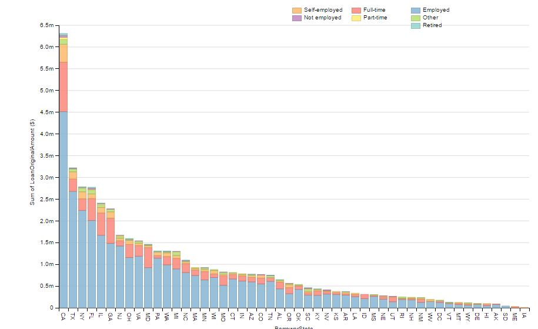

# Summary 
My visualization is for a loan data. There are 2 graphs, one shows the loan distribution among a different state with respect to the Emplyment Status, 
Second graph shows loan distribution against the employment duration in months.
In the GitHub sample data the clear pattern may not appear but locally run code on the full data showing following findinngs:
1) First Gragh clealy show that CA (California) is a leading state for taking a Loan.
2) First graph also shows most of the loan taken by Employeed people.

3) Second graph shows that please with the less experiance or who just started the employment are taking a more loan compare to the 
   other people.

# Design 
Stacked bar graph for Employment Status was choosen to incorporate as much variable as possible in a very cleanest way. Occupation was choosen 
Instead of Employment Status  but it was drop as Employment Status give better breakup of data.
The initial design was to draw line graph between Employment Duration and Loan amount. After getting a review it was changed to bar chart.

# Feedback 
Base on the below feedback graph design was changed such as I removed circles, title was given to each graph with short description, 
axis title was made some descriptive, missing values were cleaned up before putting it in graph.
Some of the feed back was not implimented like "x-values of 2nd graph is too close" because technically x-values are not turning in intervals.

Here are the feedback received from reviewer.
Ransford Hyman (Google+):-
Hi +Vijay Barai .  As Feedback, I would suggest not using the circles and 
cleaning up the x-axis in the Employment Status Duration graph.  There is color intensity 
changing in the circles and I'm not sure what that is representing.  So it seems like a distraction 
from the overall graph. I would also suggest some titles to the graphs so I as the reader 
can know what should I focus my attention on. The first graph looks nice, but the axis 
titles could be a bit more descriptive (i.e. is the y-axis represented in Dollars?).  
The medium palette colors in the first graph is nice.  Very easy on the eyes.  Hope this helps!

Suyog Karnawat (Colleage):-
Over all graph looks good. In the second Graph x-axis values a too close to read.

Sagar Barbate (Colleage):-
There are some missing values in the data which giving a false interpretation of data.
I think you should remove them before plotting it.

# Resources 
Dataset :From the given dataset I used "Intermediate-Loan Data from Prosper" data for my visualisation.
Code    : http://bl.ocks.org/
          http://d3js.org/

